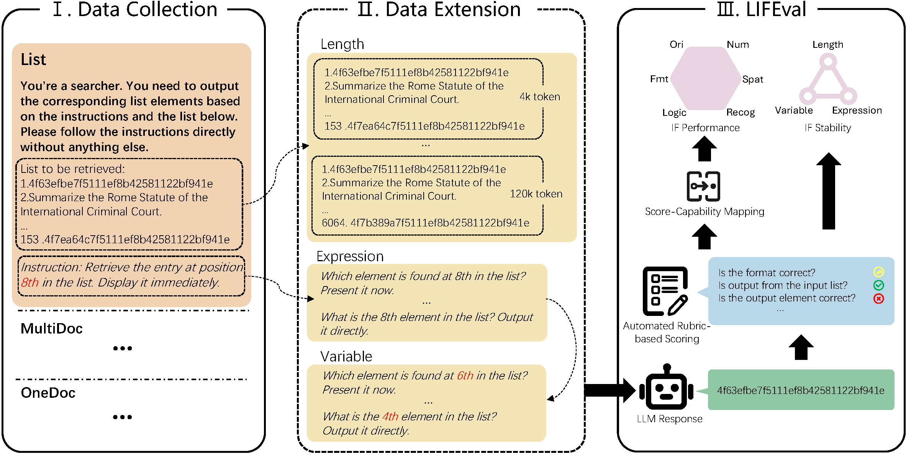

# LIFBench: Evaluating the Instruction Following Performance and Stability of Large Language Models in Long-Context Scenarios

This repo contains the official **PyTorch** code and evaluation results for LIFBench.

## Introduction




## Usage

### Requirements

Python 3.10.12

```bash
pip install -r requirements.txt
cd ./LIF-Bench-2024
```

### Construct Dataset

Set the desired length range for data generation in `./scripts/generate_prompts.sh`.

```bash
bash ./scripts/generate_prompts.sh
```

### Inference

For open-source models, specify the model weights path in `./scripts/Inference.sh`.

```bash
bash ./scripts/Inference.sh
```

For closed-source models, please specify the model name in `./scripts/Inference_api.sh` and provide the API_KEY in `./evaluation/LLMApi`.

```bash
bash ./scripts/Inference_api.sh
```

Model outputs will be stored in the `./data/outputs`.

### Evaluation

```bash
bash ./scripts/Inference_api.sh
```

By default, results will be saved in `/data/results`.
